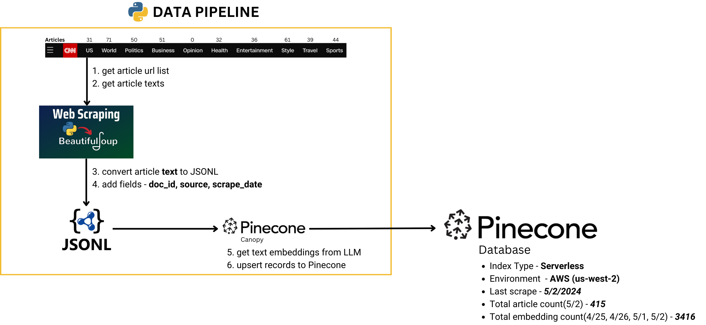
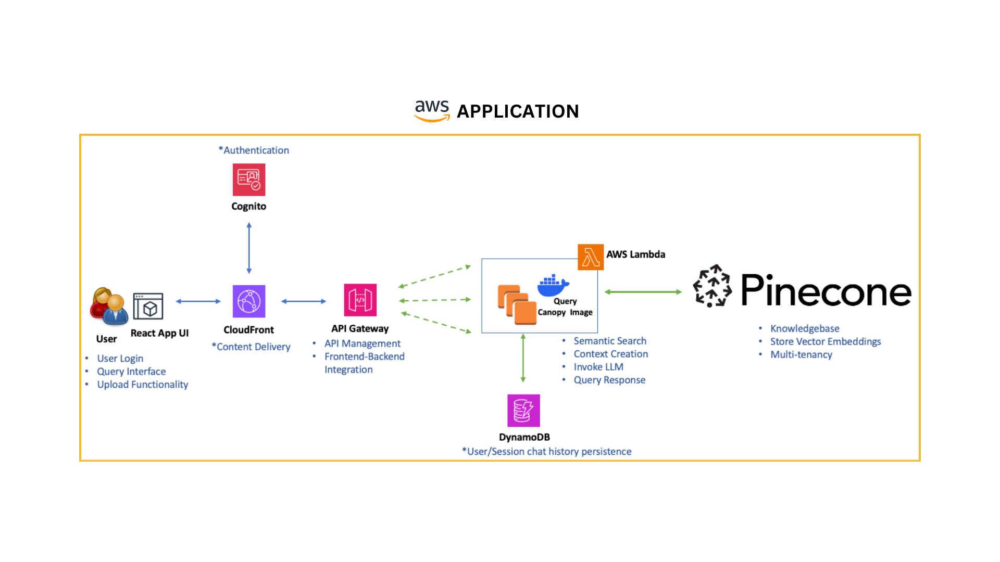

# CNN RAG
This demo re-uses Vamshi Enabothala's excellent AWS front end to canopy's chat engine and context engine
to showcase RAG on top of CNN news articles. This project contains a data pipeline for
upserting CNN articles into the "wbd" namespace. You do not need to run this data pipeline
to do a live demo. 

## Data Pipeline
The article counts, embedding counts and last scrape date may not be accurate because the pipeline
is designed to be re-run. This image provides detail on article/embedding counts as of 5/2/2024.


## Application


## Demo Script
1. Open Demo app URL: https://drr25piggkevu.cloudfront.net/. Username is: ```wbd``` and Password is: ```Wbd-demo@123```.

1. Show ```wbd``` namespace for the [canopy--pinecone-multitenant-rag-demo](https://app.pinecone.io/organizations/-NF9xx-MFLRfp0AAuCon/projects/91144fa2-322b-4809-a99b-3dccff527b27/indexes/canopy--pinecone-multitenant-rag-demo/namespaces) index.

1. Open [cnn_headlines.jsonl](./data/cnn_headlines.jsonl) and craft a user query using one of the headlines.

1. Type your user query into the demo app in the ```Type your question here``` field

1. [OPTIONAL] Check ```No-RAG``` checkbox and rerun the query to show how LLM behaves with no context.

1. [OPTIONAL] Check ```Faithfulness``` checkbox 

There is no need to run the data pipeline, but step by step instructions for doing so are provided below.

## Quickstart for running data pipeline (cnn.com scrape + canopy upsert)
Run this quickstart if you would like to web scrape CNN then upload the embeddings to Pinecone via canopy. 

### Step 1 - Install dependencies

Setup virtual environment and install the required python packages. If you do not have poetry, you will need to install
with this command:

```
cd ./cnn-rag
pip install poetry
poetry install
poetry shell
```

### Step 2 - Set environment variables
Create a file named ```.env``` that has the following variables:

```
PINECONE_NAMESPACE=wbd
PINECONE_INDEX_NAME=canopy--pinecone-multitenant-rag-demo
PINECONE_API_KEY=[YOUR_PINECONE_API_KEY]
OPENAI_API_KEY=[YOUR_OPENAI_API_KEY]
```

### Step 2 - Run Data Pipeline - scrape_cnn
You can scrape cnn.com by running the command below. The data pipeline will use BeautifulSoup to:

1. Obtain a list of URLs to scrape for the following sections - business, entertainment, health, politics, sports, style, travel, US, world
1. Scrape URLs for each section and obtain article text
1. Create a JSONL file for each section that one entry for each article - populate required canopy fields ```id``` and ```text``` and ```source``` and optional fields ```scrape_data``` and ```section``` metadata.

```
python ./data_pipeline.py scrape_cnn
```

### Step 3 - Run Data Pipeline - upsert
Canopy upsert of all JSONL files in ```./data/canopy```

```
python ./data_pipeline.py upsert
```

**IMPORTANT** - The only commands you should run are ```scrape_cnn``` and ```upsert```. This will allow us to 
grow the embedding count over time. There is no harm in re-running these operations. The same is NOT true for
```delete``` as it will delete all embeddings in the ```wbd``` namespace.
