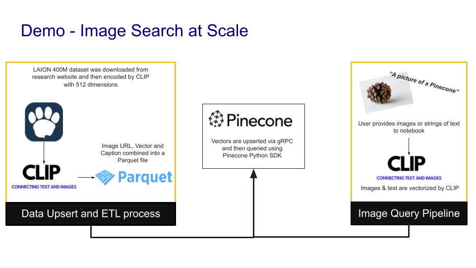

# Image Search at Scale
This demo re-uses Chris Amata's excellent image search demo.




### Step 1 - Set environment variables
Create a file named ```.env``` in the "image-search-at-scale' folder that has the following variables:


```
PINECONE_INDEX_NAME=laion-400m
PINECONE_API_KEY=[YOUR_PINECONE_API_KEY]
```

### Step 2 - Install dependencies

Setup virtual environment and install the required python packages.

```
cd ./image-search-at-scale
pip install poetry
poetry install
poetry shell
```


Start a separate terminal and run the following command to install required dependencies for the React web-app:


```
cd ./image-search-at-scale/React/search-app
npm install
```

## Step 3 - Run FastAPI
Start demo API by running the following command.


```
uvicorn main:app --reload
```


## Step 4 - Run web-app
In the terminal that you ran npm install in, run the following command to start the web-app:


```
npm run
```
The app should launch in your preferred browser


## Other notes
1. [OPTIONAL] Open a browser for this url: http://localhost:8000/docs. You can test the backend API call here and talk about how any user interface could be built on top of this endpoint.


2. You can swap the image out by doing a search on http://images.google.com and saving the image to the ```./static/image.jpeg``` file.


3. Refresh http://localhost:3000/ and similarity search will re-run against the new image.


4. Click on the ```Pinecone Logo```. It will direct link you to the index that drives this demo.


5. Show the FastAPI Console Output. The terminal output for the FastAPI application includes the following execution times: ```Get image embedding execution time in ms``` and ```Pinecone query execution time in ms```


**IMPORTANT** - Subsequent pinecone query times should drop after the initial request.
But, this is a very large dataset. Expect queries to range from a 300ms to 5000ms. 

